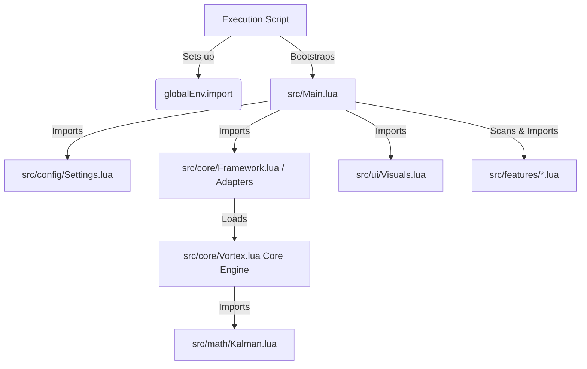

# Vortex Framework - Universal Scripting Engine

A premium, highly modularized, and clean scripting engine built on top of Roblox client environments.

Vortex is designed to run **directly from raw modular source files** without any compilation steps. It is hosted on GitHub and connects modules dynamically using a custom `import()` function. The core has been designed to be completely universal, allowing adapters to bind game-specific logic dynamically.

---

## Unified Direct API Design

Legacy scripts had to access internal registries via `FrameWork.HL.*`. Vortex unifies the HookLoader and Framework libraries under a single interface:

* **Old**: `FrameWork.HL.Hook("@Module", "func", ...)`
* **New**: `Vortex.Hook("@Module", "func", ...)` or `Framework.Hook("@Module", "func", ...)`

---

## Folder Structure

* **src/**: Contains the modular source files.
  * **core/**
    * [Vortex.lua](file:///c:/Users/Administrator/Desktop/Combat%20Warriors%20Project/src/core/Vortex.lua): The central under-the-hood engine containing hook registries, Roblox helper methods, and `PsmSignal` architecture.
    * [Framework.lua](file:///c:/Users/Administrator/Desktop/Combat%20Warriors%20Project/src/core/Framework.lua): The Combat Warriors adapter registry layer (binds weapon data queries and equips).
    * [HookLoader.lua](file:///c:/Users/Administrator/Desktop/Combat%20Warriors%20Project/src/core/HookLoader.lua): Legacy compatibility wrapper.
  * **math/**
    * [Kalman.lua](file:///c:/Users/Administrator/Desktop/Combat%20Warriors%20Project/src/math/Kalman.lua): Aim prediction physics vectors.
  * **config/**
    * [Settings.lua](file:///c:/Users/Administrator/Desktop/Combat%20Warriors%20Project/src/config/Settings.lua): Default configuration flags.
  * **ui/**
    * [Visuals.lua](file:///c:/Users/Administrator/Desktop/Combat%20Warriors%20Project/src/ui/Visuals.lua): Viewport Drawing circles (FOV visualizer).
  * **features/**: Individual cheat modules:
    * [Fly.lua](file:///c:/Users/Administrator/Desktop/Combat%20Warriors%20Project/src/features/Fly.lua): Fly mechanics (reacts to `FeatureToggled` signal).
    * [Desync.lua](file:///c:/Users/Administrator/Desktop/Combat%20Warriors%20Project/src/features/Desync.lua): Replicator packet delay toggle.
    * [SilentAim.lua](file:///c:/Users/Administrator/Desktop/Combat%20Warriors%20Project/src/features/SilentAim.lua): Projectile redirection aiming.
    * [RangeExpander.lua](file:///c:/Users/Administrator/Desktop/Combat%20Warriors%20Project/src/features/RangeExpander.lua): Melee range hit expansion (uses framework `GetPartsInRange`).
    * [AntiParry.lua](file:///c:/Users/Administrator/Desktop/Combat%20Warriors%20Project/src/features/AntiParry.lua): Suppresses attacks during target parry states.
    * [AntiRagdoll.lua](file:///c:/Users/Administrator/Desktop/Combat%20Warriors%20Project/src/features/AntiRagdoll.lua): Ragdoll state override.
    * [FastSpawn.lua](file:///c:/Users/Administrator/Desktop/Combat%20Warriors%20Project/src/features/FastSpawn.lua): Character auto-spawn loop.
    * [Stamina.lua](file:///c:/Users/Administrator/Desktop/Combat%20Warriors%20Project/src/features/Stamina.lua): Stamina depletion overrides.
  * [Main.lua](file:///c:/Users/Administrator/Desktop/Combat%20Warriors%20Project/src/Main.lua): Bootstrapper and dynamic feature scanner.

* [Execution Script.lua](file:///c:/Users/Administrator/Desktop/Combat%20Warriors%20Project/Execution%20Script.lua): Main loader script to execute in your exploit console.
* [Example Addon.lua](file:///c:/Users/Administrator/Desktop/Combat%20Warriors%20Project/Example%20Addon.lua): Template demonstrating runtime injection and framework integration.

---

## Connection Flow & Architecture

All files load dynamically, checking for local files first and falling back to GitHub:



---

## API Documentation

### State Management & Toggling

State updates are routed through `PsmSignal` events rather than direct metatables, ensuring clean synchronization with standard executor global settings tables.

#### `Vortex.SetState(FeatureName, State)`
Central state toggle controller. Sets the parameter inside `Vortex.State`, synchronizes it to `globalEnv()`, and fires the toggled signal safely.
```lua
Vortex.SetState("Fly", true) -- Toggles Fly state, updates getgenv().Fly, and fires FeatureToggled
```

---

### Universal Helpers

Vortex exposes a set of utility helper functions built directly into the core instance.

#### `Vortex.GetCharacter(Player)`
Safely returns the Roblox character model of the specified Player. Defaults to `LocalPlayer`.
- **Arguments**: `Player` *(Player, optional)*
- **Returns**: `Model` or `nil`

#### `Vortex.IsAlive(Player)`
Validates that the specified Player's character exists, has an active `HumanoidRootPart`, and has a `Humanoid` with health above 0.
- **Arguments**: `Player` *(Player, optional)*
- **Returns**: `boolean`

#### `Vortex.GetTeam(Player)`
Safely returns the Team reference of the specified Player.
- **Arguments**: `Player` *(Player, optional)*
- **Returns**: `Team` or `nil`

#### `Vortex.IsEnemy(Player)`
Compares the specified Player's team with the local player's team to determine if they are an opponent.
- **Arguments**: `Player` *(Player)*
- **Returns**: `boolean`

#### `Vortex.Notify(Type, Title, Text, Duration)`
Dispatches a modern screen toast alert if the toast system is hooked, otherwise falls back to a clean print log in the console.
- **Arguments**:
  - `Type` *(string)*: `"success"`, `"info"`, `"warning"`, or `"error"`
  - `Title` *(string)*: Title of the notification
  - `Text` *(string)*: Body text of the notification
  - `Duration` *(number, optional)*: Duration in seconds (defaults to `5`)

---

### Hooking & Modding

#### `Vortex.Hook(ModuleKey, FunctionName, HookID, HookFunc, Config)`
Hooks a module script method or global function.
- **Arguments**:
  - `ModuleKey` *(string)*: Key identifier (e.g. `"@Network"`, `"@SoundHandler"`)
  - `FunctionName` *(string)*: The name of the method to hook
  - `HookID` *(string)*: Unique identifier for this hook instance
  - `HookFunc` *(function)*: Hook wrapper function, receives `(Original, ...)`
  - `Config` *(table, optional)*: Configuration table (e.g., `{ Priority = 10, Spy = false }`)

#### `Vortex.UnHook(ModuleKey, FunctionName, HookID)`
Removes a registered hook wrapper.
- **Arguments**:
  - `ModuleKey` *(string)*
  - `FunctionName` *(string)*
  - `HookID` *(string, optional)*: If omitted, all hooks on the function are removed

---

## Live Runtime Addons (Real-Time Scripting)

Because the Vortex framework is exposed globally, standalone addon scripts run later can pull the core framework directly out of memory, hook game functions, and utilize reactive signals in real time.

### Injection Example (Standard Structure)

```lua
-- 1. Verify and capture the running framework from memory
local globalEnv = getgenv or function() return _G end
local Vortex = globalEnv()._VortexCoreInstance

if not Vortex then
    warn("[Live Inject] Vortex framework must be running first!")
    return
end

-- 2. Define the live injection module
local CustomAddon = {}

function CustomAddon.Init(Framework)
    -- Trigger toast alerts through unified helper
    Framework.Notify("success", "Custom Addon", "Merging custom hooks...", 4)

    -- Hook outgoing game events to block/track attributes
    Framework.Hook(
        "@Network",
        "FireServer",
        "AddonHook",
        function(Original, ...)
            local Args = {...}
            print("[Custom Addon] Intercepted FireServer with event name:", Args[2])
            return Original(table.unpack(Args))
        end
    )

    -- Listen to feature toggle signals from the framework
    Framework.Signals.FeatureToggled:Connect(function(FeatureName, State)
        print("[Custom Addon] Feature status changed in real-time:", FeatureName, "->", State)
    end)
end

-- 3. Execute immediately
pcall(CustomAddon.Init, Vortex)
```